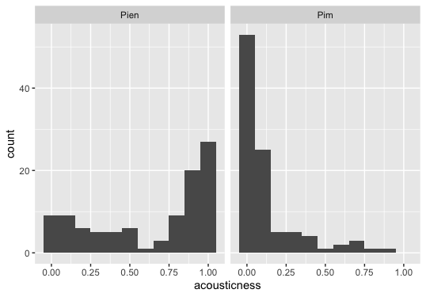

# compmusic2020
Computational Musicology

For my corpus, I would like to compare my Spotify Wrapped playlist of 2019 to the one of my boyfriend, Pim. Our taste in music is very different and those lists are representing this difference. I think it’s interesting to compare these two playlists. I’m more into soft pop music, singer-/songwriters, also a little classical music, film music, etc. And Pim is more into Drum & Bass, Rap, Hiphop, etc. But we appreciate each others taste of music increasingly.

I have some first findings, measured by Spotify, that are interesting: 
The music that Pim listens to is more danceable (M = 0.72, SD = 0.13) than the music I listen to (M = 0.48, SD = 0,19). Also there is a difference in energy. Pim’s playlist is way more energetic (M = 0.68, SD = 0.18) than mine (M = 0.34, SD = 0.25). If we look at the loudness category, Pim’s playlist is louder (M = -6.72, SD = 2.41) than mine (M = -14.1, SD = 8.79). In the figure below, we can see the differences that I discussed above. In Pim's figure, almost all of the points/dots are on the top right. This means, that the the energy and danceability is very high. The loudness is indicated with the size of the points/dots. In my figure, the points/dots are more spread out. But almost all the points/dots are very small. So in the size, Pim is more diverse. 

[image of plot](Rplot.1.png)

The keys of our playlists are a lot closer to each other. Pim: (M = 5.43, SD = 3.74), which means in the pitch class F/F#. And mine: (M = 4.54, SD = 3.35), which means in the pitch class E/F. Also the modes are close to each other. Pim: (M = 0.53, SD = 0.5) and mine: (M = 0.57, SD = 0.49). This means that we both listen to major and minor music. But we both have a low valence. We both listen to more negative sounds and sad music. Pim: (M = 0.4, SD = 0.24) and mine: (M = 0.26, SD = 0.19). 

If we look at the acousticness category, there is a difference. My playlist is more acoustic (M = 0.63, SD = 0.36) than the playlist of Pim (M = 0.13, SD = 0.19). Pim listens to music with a higher frequency. 

The results of speechiness seems a little extreme to me. Because despite the fact that Pim listens to rap, the results are very low (M = 0.14, SD = 0.11). Mine are lower than that, but I don’t listen to rap that often (M = 0.06, SD = 0.06). But I would expect that the results of the speechiness in Pim’s playlist would be between 0.33 and 0.66. I don’t think I have to exclude this because it might be an interesting thing to investigate more. 

